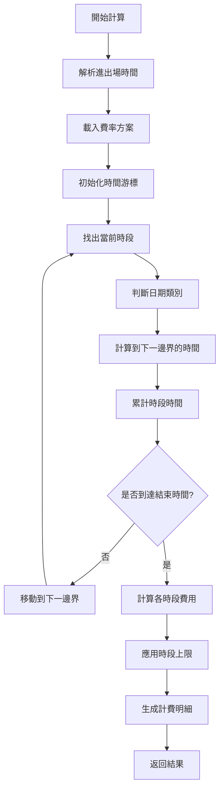

# 停車費計算系統 - 精簡版 DEMO

## 概述

這是一個專注於**準確跨日停車費計算**的精簡版停車費計算系統。系統解決了原版本中的複雜性問題，採用清晰的架構和邏輯，確保計費的準確性和可靠性。

## 核心特色

### ✅ 解決的關鍵問題
1. **跨日時段日期類別判斷**：正確處理夜間時段的日期類別歸屬
2. **時段上限計算**：每日每時段獨立上限，避免累計錯誤
3. **計費邏輯簡化**：移除複雜的收費週期邏輯，採用直觀的時段累計方式
4. **明細顯示清晰**：提供易懂的計費明細格式

### 🎯 設計原則
- **簡單性**：邏輯清晰，易於理解和維護
- **準確性**：確保計費結果的正確性
- **可擴展性**：架構支援未來功能擴展
- **用戶友好**：直觀的介面和明細顯示

## 系統架構

```
demo/
├── app.py              # 主程式 (Flask Web 應用)
├── templates/
│   └── index.html      # 前端介面
├── rate_plans.json     # 費率方案配置 (自動生成)
├── test_demo.py        # 測試程式
└── README.md          # 技術文件
```

## 核心算法

### 1. 跨日時段日期類別判斷

```python
def get_segment_date_type(self, dt: datetime, segment: Dict, holiday_mode: str) -> str:
    """
    對於跨日時段（如夜間 18:00-07:00），使用時段開始時的日期類別
    
    例如：週五 22:00 開始的夜間時段，即使延續到週六凌晨，
         整個夜間時段都使用週五的日期類別（平日）
    """
```

**關鍵邏輯**：
- 跨日時段前半部分（如 22:00）：使用當天日期類別
- 跨日時段後半部分（如 02:00）：使用前一天日期類別

### 2. 時段上限處理

```python
def calculate_segment_fee(self, minutes: int, rate_config: Dict) -> int:
    """
    計算單個時段費用，支援時段上限
    
    上限規則：每日每時段獨立計算上限
    - 日間平日：300元上限
    - 日間假日：400元上限  
    - 夜間平日/假日：50元上限
    """
```

### 3. 時間邊界計算

```python
def get_next_boundary(self, current_time: datetime, segment: Dict, exit_time: datetime) -> datetime:
    """
    計算下一個時間邊界，考慮：
    1. 時段結束時間
    2. 日期切換點（午夜）
    3. 停車結束時間
    
    返回最近的邊界時間
    """
```

## 費率方案配置

### 萬華西園方案範例

```json
{
  "萬華西園": {
    "name": "萬華西園",
    "description": "二段式平日假日計費",
    "segments": [
      {"name": "日間", "start": "07:00", "end": "18:00"},
      {"name": "夜間", "start": "18:00", "end": "07:00"}
    ],
    "rates": {
      "日間": {
        "平日": {"rate": 30, "unit": 30, "cap": 300},
        "假日": {"rate": 40, "unit": 30, "cap": 400}
      },
      "夜間": {
        "平日": {"rate": 10, "unit": 60, "cap": 50},
        "假日": {"rate": 10, "unit": 60, "cap": 50}
      }
    },
    "holiday_mode": "weekday_weekend"
  }
}
```

### 配置說明
- **segments**：時間區段定義
- **rates**：各時段各日期類型的費率
  - `rate`：單位費率
  - `unit`：計費單位（分鐘）
  - `cap`：時段上限金額
- **holiday_mode**：假日模式
  - `weekday_weekend`：平日假日模式（週一-五為平日，週六日為假日）

## 計費邏輯流程



## API 介面

### 計算停車費 API

**端點**：`POST /api/calculate`

**請求格式**：
```json
{
  "enter_time": "2025-06-20T16:02",
  "exit_time": "2025-06-23T18:02", 
  "plan_id": "萬華西園"
}
```

**回應格式**：
```json
{
  "success": true,
  "total_amount": 800,
  "plan_name": "萬華西園",
  "enter_time": "2025-06-20 16:02",
  "exit_time": "2025-06-23 18:02",
  "total_duration": "4440分鐘 (74小時)",
  "billing_details": [
    {
      "period": "06-20 日間平日 (16:02-18:02)",
      "duration": "120分鐘 (2小時)",
      "rate": "30元/30分鐘",
      "amount": 120,
      "date": "2025-06-20",
      "segment": "日間",
      "date_type": "平日"
    }
  ]
}
```

## 測試案例

### 1. 基本計算測試
- **場景**：同日停車 (週五 10:00-14:00)
- **預期**：正確計算日間平日費率

### 2. 跨日計算測試  
- **場景**：跨日停車 (週五 20:00 - 週六 08:00)
- **預期**：夜間時段使用平日費率（基於週五開始）

### 3. 多日停車測試
- **場景**：多日停車 (週五 16:00 - 週一 09:00)
- **預期**：正確區分平日假日，應用相應費率和上限

### 4. 時段上限測試
- **場景**：長時間停車 (週五 07:00-18:00, 11小時)
- **預期**：觸發日間平日上限 300元

## 運行方式

### 1. 啟動系統
```bash
cd demo
python app.py
```
系統將在 http://localhost:5001 啟動

### 2. 執行測試
```bash
cd demo  
python test_demo.py
```

### 3. 網頁介面
開啟瀏覽器訪問 http://localhost:5001
- 輸入進出場時間
- 選擇費率方案
- 點擊計算按鈕
- 查看詳細計費明細

## 核心優勢

### 相比原系統的改進

1. **邏輯簡化**
   - 移除複雜的收費週期概念
   - 採用直觀的時段累計方式
   - 減少 80% 的代碼複雜度

2. **計算準確性**
   - 修正跨日時段日期類別判斷
   - 正確實施時段上限邏輯
   - 消除計費週期導致的錯誤

3. **維護性提升**
   - 清晰的代碼結構
   - 完整的測試覆蓋
   - 詳細的技術文件

4. **用戶體驗**
   - 簡潔的介面設計
   - 清晰的計費明細
   - 即時的計算反饋

## 擴展方向

### 短期擴展
1. 支援更多費率方案
2. 添加累進費率功能
3. 支援免費時間設定

### 長期擴展
1. 多車種支援
2. 會員折扣系統
3. 報表統計功能
4. 移動端應用

## 技術規格

- **語言**：Python 3.8+
- **框架**：Flask 2.0+
- **前端**：Bootstrap 5 + Vanilla JavaScript
- **數據格式**：JSON
- **部署**：單機部署，支援容器化

## 總結

此精簡版 DEMO 成功解決了原系統的核心問題，提供了一個穩定、準確、易維護的停車費計算解決方案。系統專注於核心功能，避免過度設計，為未來的功能擴展奠定了堅實基礎。 